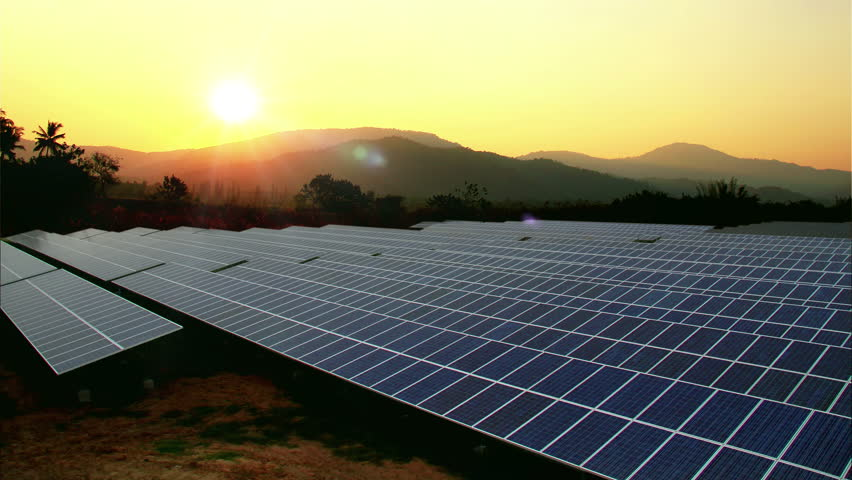

# SunDial

## Problem Statement
With the costs of solar cells and batteries continuing to decline, solar cell-battery combination systems have become viable options to save on electricity costs while offseting carbon emissions. However, electricity demand, ulility costs, and sunlight avaliability all change dynamically, making it difficult for consumers to optimize their utilization of renewable energy sources.

We aim to develop machine learning models based on weather, utility, and solar cell-battery data to optimize solar battery utilization in a dynamic environment. Our platform will be built to scale for different energy needs, from single family homes to large data centers to county-wide electricity networks. Furthermore, we hope to produce a general economic viablity assessment of solar battery installations in different regions across the United States.

## Data Sources

1. [Google's Project Sunroof](https://www.google.com/get/sunroof#p=0)
2. [U.S. Daily Climate Normals (Data.gov)](https://catalog.data.gov/dataset/u-s-daily-climate-normals-1981-2010)
3. [U.S. Energy Price Data (Data.gov)](https://catalog.data.gov/dataset?tags=energy-prices)